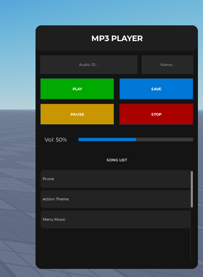
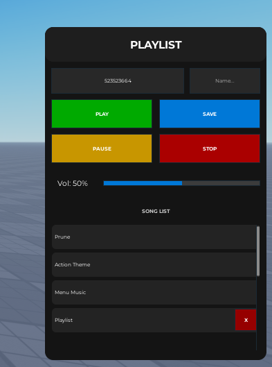
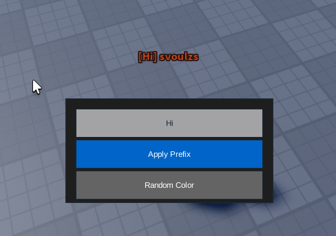
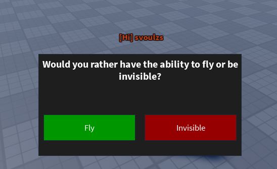

# Roblox Project

This repository contains the scripts and source files for a Roblox game experience.

## Features
- **Mini-Game System**: Randomly selects questions/games for players.
- **Voting System**: Players can vote for each other.
- **MP3 Player**: Custom music player with save capabilities.
- **Badge System**: Reward players for achievements.

## Structure
- `ServerScriptService/`: Server-side logic and services.
- `StarterGui/`: Client-side UI and local scripts.
- `ReplicatedStorage/`: Shared assets and modules.

